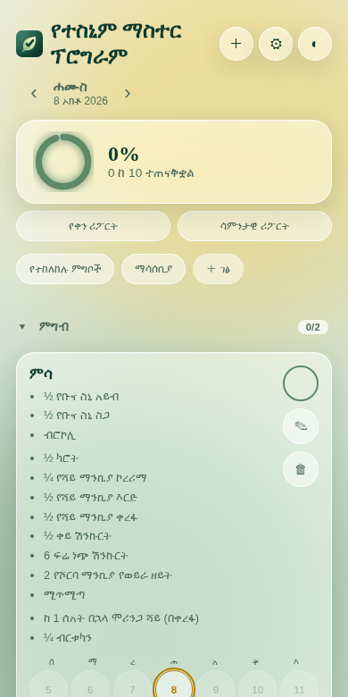
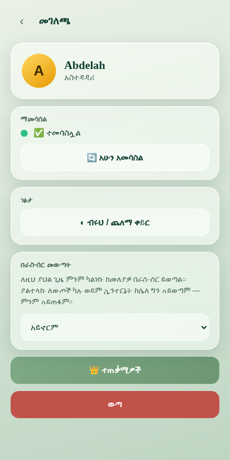

# የተስኒም ማስተር ፕሮግራም (Ye-Tesnim Master Program)

An Amharic daily-program tracker: meals, reminders and any custom activity, ticked day by day,
with percentage reports, streaks, notes, user accounts with roles, and cloud sync that keeps working offline.

| Main list (grouped by category) | Profile page | Category manager |
|---|---|---|
|  |  |  |

> **In one sentence:** a static website (plain JavaScript, built with Vite) that talks to a Supabase
> database for login and sync, and that installs on a phone like an app.

---

## Contents

1. [What it does](#1-what-it-does)
2. [Roles and permissions](#2-roles-and-permissions)
3. [How a day is counted (the rules)](#3-how-a-day-is-counted-the-rules)
4. [How sync and offline mode work](#4-how-sync-and-offline-mode-work)
5. [Architecture](#5-architecture)
6. [Tech stack](#6-tech-stack)
7. [Folder structure](#7-folder-structure)
8. [Run it on your computer](#8-run-it-on-your-computer)
9. [Supabase setup](#9-supabase-setup)
10. [Deploy (Netlify / Vercel)](#10-deploy-netlify--vercel)
11. [Data model](#11-data-model)
12. [Security notes](#12-security-notes)
13. [Troubleshooting](#13-troubleshooting)
14. [Where to edit things](#14-where-to-edit-things)
15. [Roadmap](#15-roadmap)

---

## 1. What it does

**For everyone who logs in**

- Shows the activities of **today's weekday** and lets you mark each one:
  **✓ done**, **✗ not done**, or **a percentage** (for example 60%). One tap on the circle gives ✓;
  tap **ውጤት** (result) to pick ✗ or a percentage.
- **Master activities** have sub-items. When every sub-item is ticked, the master becomes ✓ by itself.
- **Notes** (📝): write a short note on any activity for any day you may edit. A note never changes the result.
- The main list is **grouped by category** (for example "ምግብ" and "ማሳሰቢያ"). Each group header shows
  `done/total` and a fold arrow; the fold is remembered on your phone.
- Every card has a **week strip** (Mon–Sun), its **streak**, this week's %, and shortcuts to its
  **Calendar** and **Statistics**.
- **Day report** and **weekly report**: today's %, streak, what is left, a 7-day bar chart, and a "needs attention" list.
- **Reference pages** (prohibited foods, notices and any page you add) — read-only for members.
- **Profile page** (tap the round avatar, top right): your name and role, sync status, theme (light / dark),
  automatic logout, and **Logout** (two taps, so it can't happen by accident).
- **Sync dot on the avatar:** 🟢 synced · 🟡 with a number = that many ticks are waiting to be sent · ⚪ offline.
- Installable on Android / iPhone ("Add to Home Screen") and works with no internet after the first sync.

**Extra for admins and editors** (see the permission table)

- **＋ Add** an activity: category → type (single or master) → name → description → weekdays.
- **✎ quick edit** (name + description, "today only" or "every time", and the category — always "every time").
- **Edit tab** in an activity's detail page: category, type, sub-items, name, description, weekdays, delete.
- **🏷 Categories** (⚙ Settings): rename a whole category, merge two, or delete one (its activities move to another category
  or to "no category" — nothing is ever deleted).
- **🗑 Recycle Bin** (⚙ Settings): every deleted activity or page stays here until restored or deleted forever.
- **📤 / 📥 Backup** export and import (admin only).
- **👑 Users** (admin, from the profile page): create users, choose a role, and choose which activities each user sees.
  The list is grouped by category, and one switch on a group assigns all of its activities.
- **Daily reminder** at 8 AM — fires only while the app is open (a closed-app push needs a server; see the roadmap).

---

## 2. Roles and permissions

An **admin** can do everything. Everyone else gets a **role**, which is just a ready-made set of permissions.
You can still tick permissions one by one ("custom").

| Permission | Meaning |
|---|---|
| `tick` | ✓ mark activities (today) |
| `past` | change **past** days (never future days) |
| `dash` | see the overall result ring |
| `rep` | day and weekly reports |
| `stat` | Statistics tab |
| `cal` | Calendar tab |
| `add` | ＋ add activities and pages |
| `edit` | ✎ edit activities, pages and categories |
| `del` | 🗑 delete |
| `trash` | ♻ Recycle Bin |
| `set` | ⚙ Settings (reminder etc.) |

| Role | Permissions it switches on | Sees which activities |
|---|---|---|
| 👤 **Member** | `tick dash rep stat cal` | only the ones the admin assigned |
| 👁 **Viewer** | `dash rep stat cal` | only the ones assigned |
| 🕘 **History editor** | `tick past dash rep stat cal` | only the ones assigned |
| ✎ **Editor** | `add edit del trash dash rep set stat cal tick` | all |
| ⚙ **Custom** | whatever you tick | assigned, or all |
| 👑 **Admin** | everything, including Users and Backup | all |

**Day lock:** everyone edits only **today**. Past days need `past`. Future days are never editable.
The server is also asked to enforce it: if it refuses a tick, the app shows
"⛔ this day is locked" and reloads the true copy.

---

## 3. How a day is counted (the rules)

One rule is used everywhere — the list, the ring, the reports, the streaks, the calendar and the statistics:

> An activity counts on a day only if **(1)** its weekdays *on that day* include that weekday, **(2)** that day is on or after the day it
> was created (a real tick or note on an earlier day is never hidden), and **(3)** it was not in the Recycle Bin that day.

What this means in practice:

- **Adding** an activity today does not change yesterday, and it can't reset your streak.
- **Deleting** one keeps it counting on the days *before* the deletion (shown greyed-out on those days as "🗑 ተሰርዟል").
  Restoring it does not make the days it spent in the bin count.
- **Changing the weekdays**, **adding or removing a sub-item**, or **switching single ↔ master** takes effect **from today**;
  days already over keep the shape they had.
- Only **deleting forever** from the Recycle Bin erases an activity's past results.

**Scoring:** ✓ = 100, a percentage = that number, ✗ or untouched = 0. A day's % is the average over that day's activities.
The **streak** counts consecutive days where *every* activity was ✓; an unfinished *today* does not break it.

---

## 4. How sync and offline mode work

- Every change you make is saved on the phone first (`localStorage`), then sent to the server about a second later.
- While the app is on screen it checks the server **once a minute** for changes by other people.
- **Ticks are merged, never overwritten:** the app sends only the ticks *this* phone changed, so two people ticking at once don't erase each other.
- **Offline:** the app opens from the saved copy and keeps counting your ticks. They are sent automatically when the internet returns
  (the avatar shows 🟡 + the number meanwhile).
- **Logout never throws away unsent ticks:** it tries to send them first and warns you if it can't.
- **Automatic logout** (profile page, off by default) only fires when the phone is online and nothing is waiting to be sent.
- The very **first login needs internet**. After one successful sync, the app opens offline.
- A **service worker** (`public/sw.js`) asks the network first, so a new version always reaches the phone; if the network is
  missing or slower than 3 seconds it uses the saved copy.

---

## 5. Architecture

```
 Phone / browser                                                  Supabase (cloud)
 ┌──────────────────────────────────────────────────┐             ┌──────────────────────┐
 │ index.html  – page shell and all dialogs          │             │ Postgres database     │
 │ src/main.js – the app (lists, reports, editing)   │             │ + SQL functions (RPC) │
 │ src/data.js – built-in meals, reminders, pages    │  HTTPS      │   app_login           │
 │ public/cloud.js – login, sync, roles, profile,    │ ──────────► │   app_get             │
 │                   user admin (loaded BEFORE main) │  /rest/v1/  │   app_put             │
 │ public/sw.js – offline copy of the app            │  rpc/…      │   app_put_log         │
 │ localStorage – the phone's saved copy             │ ◄────────── │   admin_list/save/del │
 └──────────────────────────────────────────────────┘             └──────────────────────┘
```

- `cloud.js` is a classic script that runs first. After login it writes the person's role into `localStorage`, then `main.js` starts and reads it.
- `cloud.js` watches writes to the app's `localStorage` keys and pushes them to the server (that is how sync is "invisible" to `main.js`).
- There is no framework and no build-time secret: the built site is plain static files.

---

## 6. Tech stack

- **Front end:** vanilla JavaScript (ES modules), plain CSS (glassmorphism, light/dark), no framework.
- **Build:** [Vite](https://vitejs.dev) 5.
- **Backend:** [Supabase](https://supabase.com) (Postgres) called through SQL functions over REST (RPC).
- **Hosting:** any static host — Netlify (primary) and Vercel (backup).
- **Phone install:** web app manifest + service worker (PWA).

---

## 7. Folder structure

```
tesnim-master-program/
├── index.html                 # page shell, dialogs, category manager and detail views (markup)
├── package.json               # scripts: dev, build, preview
├── vite.config.js             # base './' so the build works at any path
├── netlify.toml               # Netlify: build "npm run build", publish "dist"
├── .gitignore                 # node_modules, dist, .env
├── README.md
├── docs/
│   └── screenshots/           # images used by this README
├── public/                    # copied as-is into the build
│   ├── cloud.js               # login + sync + roles + profile page + user admin  (EDIT the 2 config lines here)
│   ├── sw.js                  # offline service worker (network first, 3 s fallback)
│   ├── manifest.webmanifest   # "Add to Home Screen"
│   ├── favicon.svg / favicon.ico / apple-touch-icon.png
│   └── icon-192.png / icon-512.png / icon-maskable-512.png
└── src/
    ├── main.js                # the app: counting rules, list, reports, editing, categories, recycle bin, backup
    ├── data.js                # built-in meals, daily reminders and reference pages
    └── style.css              # colours, layout, all components
```

---

## 8. Run it on your computer

Needs [Node.js](https://nodejs.org) 18 or newer.

```bash
npm install
npm run dev        # opens http://localhost:5173
npm run build      # makes the static site in dist/
npm run preview    # test the built site
```

`npm run dev` is free and does not touch Netlify — use it to test before you push.

---

## 9. Supabase setup

**The two lines to edit** are at the top of `public/cloud.js`:

```js
var SB_URL = 'https://YOUR-PROJECT.supabase.co', SB_KEY = 'YOUR-ANON-PUBLIC-KEY';
```

Find them in Supabase → **Project Settings → API** (the *Project URL* and the *anon public* key).
If `SB_URL` still starts with `YOUR-`, the app runs in plain local mode with no login.

**The database functions.** The app calls these SQL functions (RPC):

| Function | Used for |
|---|---|
| `app_login(p_user, p_pass)` | log in, returns a session `token` |
| `app_get(p_tok)` | everything this user may see: `user`, `shared`, `mine`, `log`, version numbers |
| `app_put(p_tok, p_shared, p_mine)` | save shared data (programs, pages, trash…) and the user's own settings |
| `app_put_log(p_tok, p_changes)` | save ticks (only the changed ones; returns the ones it refused) |
| `admin_list(p_tok)` | admin: list users |
| `admin_save(p_tok, p_id, p_username, p_pass, p_admin, p_perms, p_programs)` | admin: create / edit a user |
| `admin_delete(p_tok, p_id)` | admin: delete a user |

> ⚠ **The SQL that creates these tables and functions is not in this repository yet** — it only exists inside the Supabase project.
> Until it is exported into a `/supabase` folder, a new Supabase project **cannot** be set up from this repo alone.
> To export it: Supabase → **SQL Editor** → copy each function (and table definition) into `supabase/*.sql`. This is the first task of the next bundle.

---

## 10. Deploy (Netlify / Vercel)

**Netlify**

1. Push the project to GitHub.
2. Netlify → **Add new site → Import an existing project** → pick the repository.
3. `netlify.toml` already sets the build command (`npm run build`) and the publish folder (`dist`). Click **Deploy**.
4. Every push to the connected branch deploys automatically.

Tip: each production deploy uses build minutes/credits on your plan. Test locally with `npm run dev`, and push to a **branch** (previews)
and merge to the main branch only when a set of changes is finished.

**Vercel** — import the repository; Vite is detected automatically (`npm run build`, output `dist`).

No environment variables are needed: the Supabase URL and public key are the two lines in `public/cloud.js`.
Deploy at the **root of a domain** (both hosts do this by default).

---

## 11. Data model

Everything lives in `localStorage` on the phone and, for shared data, in the server.

**Activity** (`tesnim_programs` is an array of these)

```js
{
  id, name, desc,
  category: 'ምግብ',                    // the category name (text, shared by all its activities)
  type: 'simple' | 'checklist',        // single ✓  |  master with sub-items
  subItems: [{ id, name }],            // masters only
  schedule: 'daily' | [1..7],          // 1 = Monday … 7 = Sunday
  seed: true|false,                    // came from data.js
  customized: true|false,              // edited by a person (then data.js stops refreshing its text)
  createdAt: '2026-10-04',             // the first day it counts
  // history helpers, added automatically:
  catSet: true,                        // the category was chosen by a person (data.js must not undo it)
  sh: [{ u, s }],                      // weekdays it had before day u
  vh: [{ u, t, s }],                   // type / sub-items it had before day u
  off: [[from, to]]                    // days it spent in the Recycle Bin before being restored
}
```

**Results** (`tesnim_log`): `log['2026-10-04'][activityId]` is one of

```js
true                              // ✓ done
{ r: 'x' }                        // ✗ not done
{ r: 'p', p: 60 }                 // 60 %
{ subId1: true, subId2: true }    // a master's sub-ticks
{ …any of the above, n: 'text' }  // plus a note
```

**Other keys:** `tesnim_pages`, `tesnim_trash` (Recycle Bin), `tesnim_removed_seeds`, `tesnim_dayov` ("today only" edits),
`tesnim_first` (first day used), `tesnim_theme`, `tesnim_reminder`, `tesnim_catfold` (folded groups), `tesnim_autologout`,
and — written by `cloud.js` — `tesnim_token`, `tesnim_me`, `tesnim_role`, `tesnim_prev`, `tesnim_dirty`, `tesnim_cv`, `tesnim_curv`.

**Categories** are not a separate table: a category is the name written on its activities. Two spellings that differ only by
spaces or capital letters ("ምግብ" and "ምግብ ") are treated as one, and everything that saves a category goes through one function
so a duplicate can't be created again.

---

## 12. Security notes

- The Supabase **anon key is public by design** (it is in the website's code). **All protection must live in the SQL functions on the server.**
  Because that SQL is not in this repo, it cannot be reviewed here.
- The built-in meals and reminders in `src/data.js` are part of the **public JavaScript** — anyone who opens the site's files can read them.
  Hiding an activity from a member hides it in the app, not from someone inspecting the files. Put anything private in activities you add
  inside the app, not in `data.js`.
- Restricted members only get their assigned activities in their program list, but the **Recycle Bin** is part of the shared data that
  goes to every phone (the app hides it). Server-side filtering is planned.
- The login password field uses a normal password box; the admin user form shows a typed password in clear text on screen.
- **Use 📤 Backup regularly.** Clearing the browser's data on a phone removes its local copy (the server copy remains).

---

## 13. Troubleshooting

| Problem | What to check |
|---|---|
| Login says "connection failed" | Is the phone online? Are `SB_URL` / `SB_KEY` in `public/cloud.js` correct? |
| "ስሙ ወይም የይለፍ ቃሉ ትክክል አይደለም" | Wrong user name or password. |
| App won't open offline on a new phone | The very first login needs internet. Sign in once, wait for 🟢, then it opens offline. |
| Ticks stay 🟡 | They are waiting for internet; they are sent automatically. Profile → "🔄 አሁን አመሳስል" forces a try. |
| "⛔ ይህ ቀን ተቆልፏል" | You tried to change a past or future day without the `past` permission. |
| An old version keeps showing | Close and reopen the app once (the service worker asks the network first). |
| Amharic text looks different on some phones | The Inter font has no Amharic letters, so Amharic is drawn with the phone's own font. |
| Installed app is blank at a sub-folder URL | The service worker is registered as `/sw.js`; deploy at a domain root. |
| `npm run build` fails | Use Node 18+, run `npm install` first. |

---

## 14. Where to edit things

- **Built-in meal / reminder / page text** → `src/data.js`. A fix there reaches everyone who has not personally edited that item.
- **Colours** → the `:root { … }` block at the top of `src/style.css`.
- **App name, logo, tab title** → `index.html` (marked with comments).
- **Supabase URL and key** → the first lines of `public/cloud.js`.
- **Roles and permission names** → `ROLES` and `PERMS` near the top of `public/cloud.js`.

---

## 15. Roadmap

**Next (needs the server):** export the SQL into `/supabase`; compute the shared dashboard on the server so nobody can see names of
activities that aren't theirs; filter tick logs, notes and the Recycle Bin per user on the server; real category objects (colour, order)
stored on the server so assigning a category can also cover activities added later; login rate-limiting and token expiry; automatic backups.

**Then (reliability):** move storage from `localStorage` to IndexedDB with the log split by month; send only changes since the last sync;
bundle an Ethiopic font subset for offline; fix the service-worker path for sub-folder deploys; one data layer instead of patching
`localStorage.setItem` and reloading the page.

**Later:** real push reminders (Web Push), fingerprint unlock, unit tests for the counting and sync logic, and splitting `main.js` into modules.
